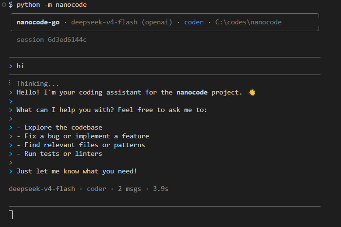

# nanocode

Minimal coding agent. Zero dependencies, ~500 lines. Uses the [OpenCode Go](https://opencode.ai) API.

Install once, then run `nanocode` from **any directory** — no need to `cd` into the project folder.



## Features

- Full agentic loop with tool use (auto-iterates until no more tool calls)
- Tools: `read`, `write`, `edit`, `glob`, `grep`, `bash`
- 6 built-in agent personas with file-based prompts (`coder`, `architect`, `reviewer`, `debugger`, `tester`, `refactor`)
- Per-agent conversation memory — switching agents preserves context for each
- `/askall` to broadcast a prompt to all agents and collect their responses
- Conversation history with `/c` to clear
- Colored terminal output
- Auto-detects OpenAI vs Anthropic API style based on model family
- Switch models in-session with `/model`

## Setup

### Dev (run from source, no install)

```bash
git clone <repo> && cd nanocode
cp .env.example .env          # then edit .env with your API key
python -m nanocode
```

`.env` is auto-loaded from CWD.  Env vars take precedence.

### Prod (global install)

```bash
git clone <repo> && cd nanocode
pip install .
```

Then set your key permanently:

```bash
# Linux / macOS — add to ~/.bashrc or ~/.zshrc
export OPENCODE_GO_API_KEY="your-key"

# Windows cmd (restart terminal after)
setx OPENCODE_GO_API_KEY "your-key"

# Windows PowerShell
[Environment]::SetEnvironmentVariable("OPENCODE_GO_API_KEY", "your-key", "User")
```

Now run from **any directory**:

```bash
nanocode
```

> Accepts `OPENCODE_GO_API_KEY` or `OPENCODE_API_KEY`.  Optional: `MODEL`, `MAX_TOKENS`, `AGENT`, `AGENTS_DIR`.

## Commands

| Command | Description |
|---|---|
| `/c` | Clear all agent conversations |
| `/q`, `exit` | Quit |
| `/models` | Fetch and list available OpenCode Go models |
| `/model` | Show current model |
| `/model <id\|num>` | Switch model (e.g. `/model deepseek-v4-pro` or `/model 3`) — clears all conversations |
| `/agents` | List available agent personas |
| `/agent` | Show current agent |
| `/agent <id\|num>` | Switch agent (e.g. `/agent reviewer` or `/agent 3`) |
| `/askall <prompt>` | Send prompt to all 6 agents and collect their responses |
| `/help` | Show help, current model, and current agent |

## Tools

| Tool | Description |
|---|---|
| `read` | Read file with line numbers, offset/limit |
| `write` | Write content to file |
| `edit` | Replace string in file (must be unique unless `all=true`) |
| `glob` | Find files by pattern, sorted by mtime |
| `grep` | Search files for regex |
| `bash` | Run shell command (30s timeout) |

## Agents

nanocode ships with 6 agent personas, each with a distinct prompt loaded from `agents/*.md`:

| Agent | File | Role |
|---|---|---|
| `coder` | `agents/coder.md` | Concise coding (default) |
| `architect` | `agents/architect.md` | Design, tradeoffs, structure |
| `reviewer` | `agents/reviewer.md` | Bug hunting, security, code quality |
| `debugger` | `agents/debugger.md` | Root-cause analysis, hypothesis testing |
| `tester` | `agents/tester.md` | Test authoring, edge cases, isolation |
| `refactor` | `agents/refactor.md` | Improve structure, reduce duplication |

### Customizing agents

Edit the `.md` files directly — changes take effect immediately with no restart. Use `{cwd}` as a placeholder for the current working directory.

To add a new agent, add a `.md` file to the agents directory and register it in `AGENT_FILES` inside `nanocode/cli.py`. Point `AGENTS_DIR` at a different folder to use your own agent library:

```bash
export AGENTS_DIR="/home/me/my-agents"
```

## Example

```
nanocode-go | deepseek-v4-flash (openai) | coder | /home/user/project

──────────────────────────────────────
> what files are here?
──────────────────────────────────────

> glob(**/*.py)
  `- nanocode.py

> There's one Python file: nanocode.py
```

## License

MIT
